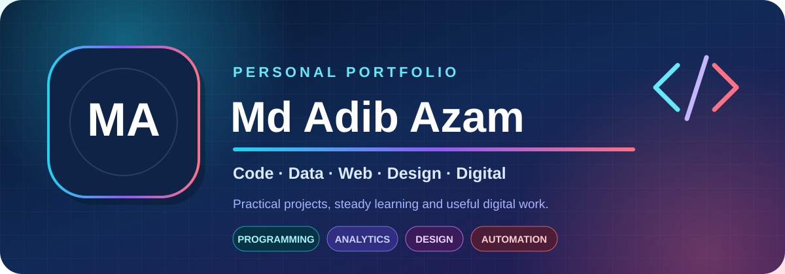
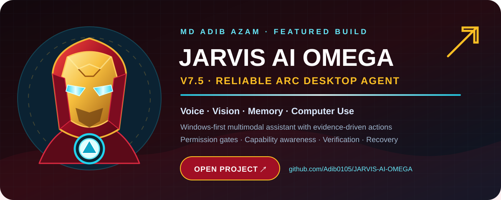
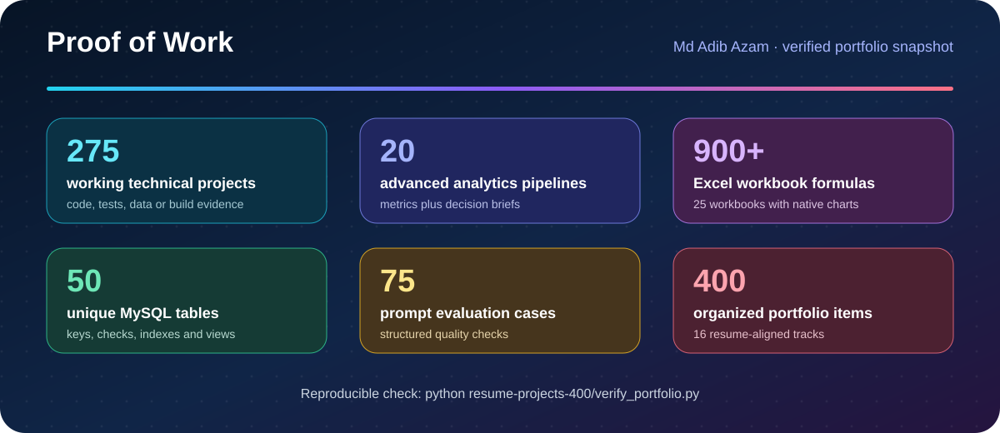
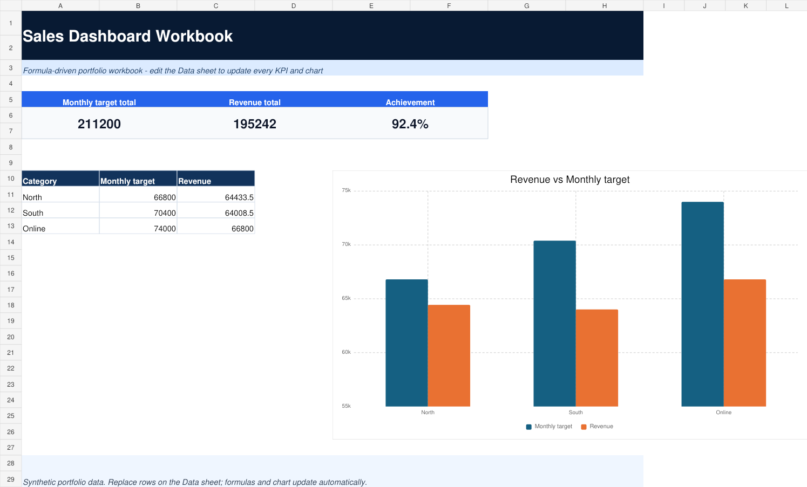

<div align="center">



[](https://github.com/Adib0105/Md-Adib-Azam/actions/workflows/resume-portfolio.yml)
[](https://github.com/Adib0105)
[](https://linkedin.com/in/mdadibazam)
[](PORTFOLIO_SHOWCASE.md)

</div>

## Featured Project — JARVIS AI OMEGA

<div align="center">

<a href="https://github.com/Adib0105/JARVIS-AI-OMEGA">
  
</a>

**Click the card to explore JARVIS AI OMEGA V7.5 →**

Windows-first multimodal desktop agent with voice, vision, memory, computer use, permission gates, evidence-based verification and controlled recovery.

</div>

## Hello, I am Md Adib Azam 👋

I am a Computer Science & Technology diploma student from Durgapur. I build practical tools across programming, data analytics, web development, databases, automation and digital operations.

My project workflow is simple: **understand the problem → build a usable solution → verify the important behaviour → explain the result clearly.**

## Recruiter quick tour

| Time | Start here | What it shows |
|---:|---|---|
| 5 min | [Flagship Project Showcase](PORTFOLIO_SHOWCASE.md) | Eight concise case studies with problems, implementation details, metrics and test commands |
| 10 min | [Advanced Data Analytics](advanced-data-analytics/) | 20 end-to-end analytical pipelines with decision briefs |
| 10 min | [CV-Aligned Applications](CV_PROJECTS.md) | 20 multi-file projects across Python, web, SQL, C and Java |
| Deep dive | [Complete 400-Item Collection](resume-projects-400/) | 16 resume-aligned tracks with a reproducible quality gate |

## Flagship work

| Project | Problem solved | Evidence |
|---|---|---|
| [JARVIS AI OMEGA V7.5](https://github.com/Adib0105/JARVIS-AI-OMEGA) | Coordinates voice, vision, memory and computer-use capabilities through a permission-aware desktop agent | Separate public repository with architecture, security, testing and Windows build documentation |
| [Advanced Analytics Portfolio](advanced-data-analytics/) | Turns business questions into reproducible analytical decisions | 20 pipelines; metrics and decision briefs for every run |
| [Customer Support SLA Dashboard](28-customer-support-sla-dashboard/) | Tracks open work, breaches, response time and agent load | Separate UI/logic modules with passing Node tests |
| [Digital Seva Workflow](30-digital-seva-workflow/) | Controls a service request from receipt to delivery | Validation, ordered states, local persistence and tests |
| [MySQL Helpdesk Database](37-mysql-helpdesk-schema/) | Models support operations and reusable SLA reporting | Six-table relational design, constraints, indexes and views |
| [Sales Forecast Studio](36-sales-forecast-studio/) | Produces an understandable baseline sales forecast | Moving average, linear trend and holdout MAE |
| [Security Header Auditor](38-security-header-auditor/) | Reviews saved web-security headers without live scanning | Five defensive checks with offline automated tests |
| [Resume–Job Matcher](26-ai-resume-job-matcher/) | Explains keyword coverage instead of returning a mystery score | Local deterministic scoring, matched/missing terms and tests |
| [Excel Sales Dashboard](resume-projects-400/10-excel-ms-office/01-sales-dashboard-workbook/) | Gives operational users a familiar KPI workbook | 45 formulas, structured table, two sheets and a native chart |

[Read the full case studies and reproduce the results →](PORTFOLIO_SHOWCASE.md)

## Verified portfolio evidence



The main quality gate checks unique implementations, Python tests, strict C builds, Java runs, web logic, WordPress safeguards, SQL integrity, generated analytics output, prompt evaluations, XLSX structure and defensive-security tests.

```bash
python resume-projects-400/verify_portfolio.py
```

Expected result:

```text
PASS: 275 implemented projects, 125 clean upload slots, 400 indexed items
PASS: unique code, tests/builds, SQL integrity, XLSX formulas/charts, output and link checks
```

## Selected visual outputs

<table>
  <tr>
    <td width="55%" valign="top">
      <strong>Analytics project gallery</strong><br><br>
      
    </td>
    <td width="45%" valign="top">
      <strong>Excel sales dashboard</strong><br><br>
      
    </td>
  </tr>
</table>

## Technical toolkit

<div align="center">


</div>

## Complete project library

The collection contains **25 organized items in each of 16 skill tracks**:

- **275 working technical projects:** Python, C, Java, Web Development, WordPress, MySQL, Generative AI, Data Analytics, Prompt Engineering, Excel/MS Office and defensive Cybersecurity.
- **125 clean creative upload spaces:** Canva, Photoshop, Illustrator, Video Editing and Digital Marketing. These remain intentionally empty until I add my finished media files.

[Browse all 16 tracks](resume-projects-400/) · [Open the 400-item index](resume-projects-400/PROJECT_INDEX.md) · [Read the quality report](resume-projects-400/QUALITY_REPORT.md)

## More work

- [Responsive Developer Portfolio](40-responsive-portfolio-site/)
- [Graphic Design Portfolio](graphic-design-portfolio/)
- [Creative Suite Projects](creative-suite-projects/)
- [Career Category Hub](categories/)

---

<div align="center">

### Thanks for reviewing my work

**Md Adib Azam** · Learn · Build · Test · Improve

[GitHub](https://github.com/Adib0105) · [LinkedIn](https://linkedin.com/in/mdadibazam)

</div>
