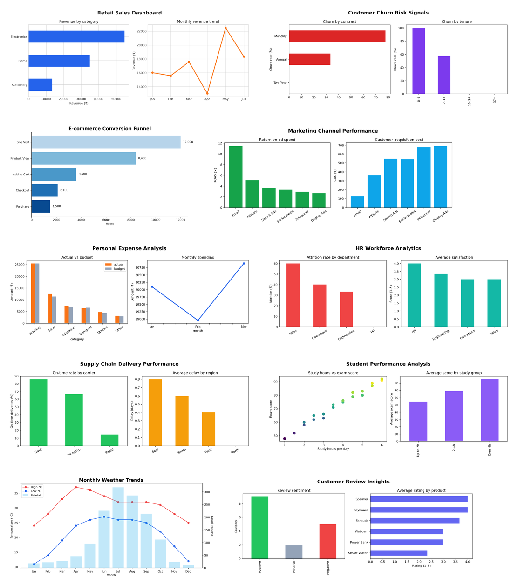

# Data Analytics Portfolio — Md Adib Azam

Ten end-to-end analytics projects built with Python, pandas, Matplotlib, and practical business questions. Every project contains a dataset, a reproducible analysis script, a chart, and concise findings.



## Projects

| # | Project | Business question | Skills |
|---|---|---|---|
| 01 | [Retail Sales Dashboard](01-retail-sales/) | Which categories and months drive revenue? | KPI analysis, aggregation, time series |
| 02 | [Customer Churn Analysis](02-customer-churn/) | Which customer groups are most likely to leave? | Segmentation, churn rate, risk signals |
| 03 | [E-commerce Funnel](03-ecommerce-funnel/) | Where do shoppers drop out? | Funnel metrics, conversion analysis |
| 04 | [Marketing ROI](04-marketing-roi/) | Which channel produces the strongest return? | CAC, ROAS, campaign comparison |
| 05 | [Expense Analysis](05-expense-analysis/) | Where is monthly spending concentrated? | Budget variance, category analysis |
| 06 | [HR Workforce Analytics](06-hr-workforce/) | What patterns appear in attrition and satisfaction? | HR KPIs, grouped analysis |
| 07 | [Supply Chain Delivery](07-supply-chain/) | Which regions and carriers miss delivery targets? | SLA analysis, operational KPIs |
| 08 | [Student Performance](08-student-performance/) | Which study patterns are linked with better results? | Correlation, cohort comparison |
| 09 | [Weather Trends](09-weather-trends/) | How do temperature and rainfall change by month? | Trend analysis, dual-axis charting |
| 10 | [Review Insights](10-review-insights/) | What themes appear in customer feedback? | Text cleaning, sentiment, optional AI summary |

## Quick start

```bash
python -m venv .venv
source .venv/bin/activate  # Windows: .venv\\Scripts\\activate
pip install -r requirements.txt
python run_all.py
```

Charts are written to each project's `outputs/` folder. All datasets are small, synthetic, and safe to publish.

## Tools demonstrated

- Python, pandas, NumPy
- Matplotlib data visualization
- Business KPI design
- Reproducible analysis workflows
- Markdown documentation
- OpenAI Responses API as an optional extension in Project 10

## Author

**Md Adib Azam** — Computer Science & Technology student interested in data analytics, Python, and practical business technology.
