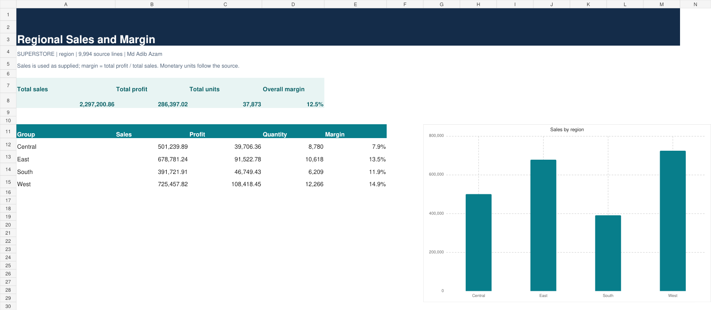

# 01. Regional Sales and Margin

Tool: **Excel** | Dataset: [original Superstore CSV](../datasets/source_superstore.csv)

## Business question

Which regions turn sales into profit most efficiently?

## Run and reproduce

From the collection root:

```bash
python 01-regional-sales-and-margin/analysis.py
```

[Results](results.csv) · [Readable report](report.html) · [Runner](analysis.py) · [SQL](analysis.sql) · [Excel workbook](analysis.xlsx)



## Method

SQL is in analysis.sql (SQLite dialect); source is loaded automatically by the runner.

All 9,994 source rows remain available. No unrelated columns are fabricated. [Metric definitions and assumptions](../METRIC_DEFINITIONS.md) apply to every result. Columns in results.csv are the exact implemented metrics, not aspirational KPIs.

## Measured output

Output records: 4. First five records:

```csv
dimension,sales,profit,quantity,margin
Central,501239.8908,39706.3625,8780,0.0792
East,678781.24,91522.78,10618,0.1348
South,391721.905,46749.4303,6209,0.1193
West,725457.8245,108418.4489,12266,0.1494
```


## Decision use and limits

Use the ranked values or estimated effects to prioritize further investigation. These results describe the supplied observation window, not a causal effect or guaranteed future performance. Do not infer churn, stock levels, advertising ROI or delivery SLA from absent data. Compare totals and the independent checks in [verification](../VERIFICATION.json) before interpreting.

## Excel refresh note

For Excel projects, source-derived Input rows are editable and summary formulas recalculate over the current row range. To add source rows or new dimension members, rerun the builder or extend the input/formula ranges and dimension list. These are formula-driven reports, not native PivotTables.
