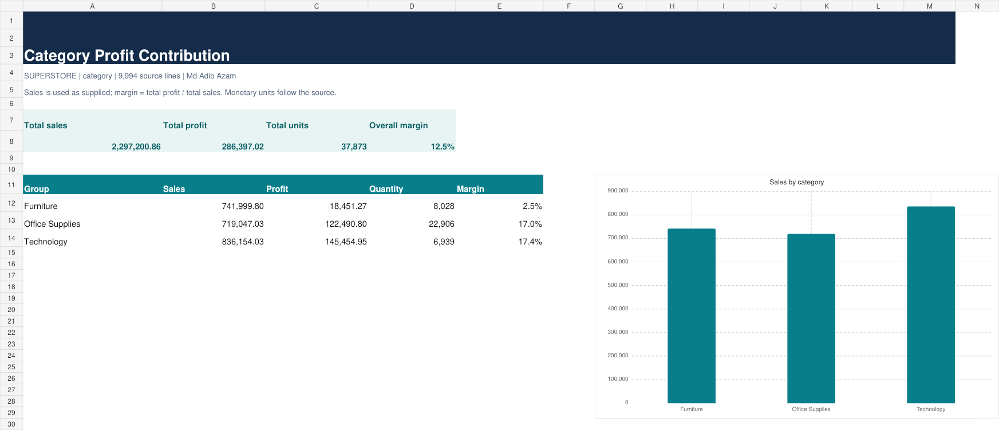

# 02. Category Profit Contribution

Tool: **Excel** | Dataset: [original Superstore CSV](../datasets/source_superstore.csv)

## Business question

How much profit does each category contribute?

## Run and reproduce

From the collection root:

```bash
python 02-category-profit-contribution/analysis.py
```

[Results](results.csv) · [Readable report](report.html) · [Runner](analysis.py) · [SQL](analysis.sql) · [Excel workbook](analysis.xlsx)



## Method

SQL is in analysis.sql (SQLite dialect); source is loaded automatically by the runner.

All 9,994 source rows remain available. No unrelated columns are fabricated. [Metric definitions and assumptions](../METRIC_DEFINITIONS.md) apply to every result. Columns in results.csv are the exact implemented metrics, not aspirational KPIs.

## Measured output

Output records: 3. First five records:

```csv
dimension,sales,profit,quantity,margin
Furniture,741999.7953,18451.2728,8028,0.0249
Office Supplies,719047.032,122490.8008,22906,0.1704
Technology,836154.033,145454.9481,6939,0.174
```


## Decision use and limits

Use the ranked values or estimated effects to prioritize further investigation. These results describe the supplied observation window, not a causal effect or guaranteed future performance. Do not infer churn, stock levels, advertising ROI or delivery SLA from absent data. Compare totals and the independent checks in [verification](../VERIFICATION.json) before interpreting.

## Excel refresh note

For Excel projects, source-derived Input rows are editable and summary formulas recalculate over the current row range. To add source rows or new dimension members, rerun the builder or extend the input/formula ranges and dimension list. These are formula-driven reports, not native PivotTables.
