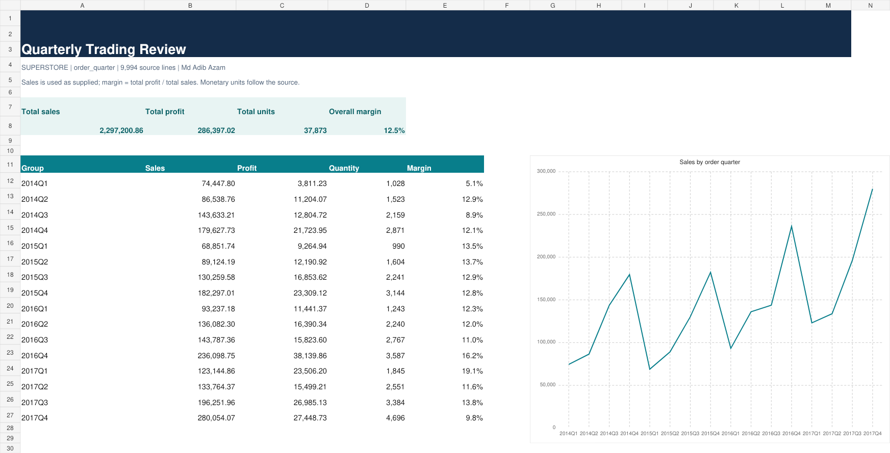

# 10. Quarterly Trading Review

Tool: **Excel** | Dataset: [original Superstore CSV](../datasets/source_superstore.csv)

## Business question

What quarterly pattern is visible in sales and margins?

## Run and reproduce

From the collection root:

```bash
python 10-quarterly-trading-review/analysis.py
```

[Results](results.csv) · [Readable report](report.html) · [Runner](analysis.py) · [SQL](analysis.sql) · [Excel workbook](analysis.xlsx)



## Method

SQL is in analysis.sql (SQLite dialect); source is loaded automatically by the runner.

All 9,994 source rows remain available. No unrelated columns are fabricated. [Metric definitions and assumptions](../METRIC_DEFINITIONS.md) apply to every result. Columns in results.csv are the exact implemented metrics, not aspirational KPIs.

## Measured output

Output records: 16. First five records:

```csv
dimension,sales,profit,quantity,margin
2014Q1,74447.796,3811.229,1028,0.0512
2014Q2,86538.7596,11204.0692,1523,0.1295
2014Q3,143633.2123,12804.7218,2159,0.0891
2014Q4,179627.7302,21723.9541,2871,0.1209
2015Q1,68851.7386,9264.9416,990,0.1346
```


## Decision use and limits

Use the ranked values or estimated effects to prioritize further investigation. These results describe the supplied observation window, not a causal effect or guaranteed future performance. Do not infer churn, stock levels, advertising ROI or delivery SLA from absent data. Compare totals and the independent checks in [verification](../VERIFICATION.json) before interpreting.

## Excel refresh note

For Excel projects, source-derived Input rows are editable and summary formulas recalculate over the current row range. To add source rows or new dimension members, rerun the builder or extend the input/formula ranges and dimension list. These are formula-driven reports, not native PivotTables.
