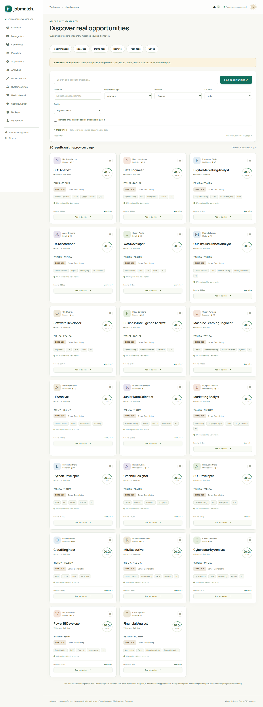
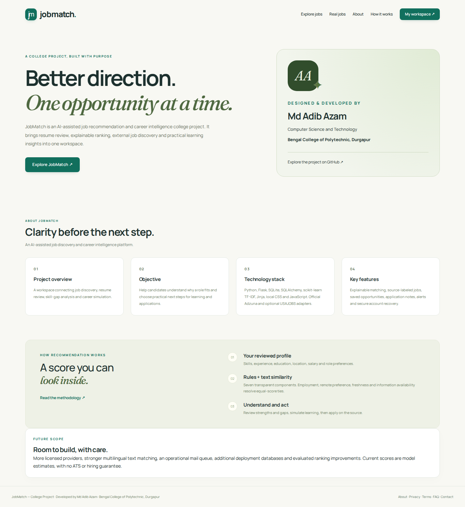

<div align="center">


# JobMatch

**AI Job Discovery & Career Intelligence Platform**

[Quick start](#run-locally) · [Hinglish guide](START_HERE_HINGLISH.md) · [AI/ML report](docs/FINAL_AI_ML_REPORT.md) · [ML architecture](docs/AI_ML_ARCHITECTURE.md) · [Evaluation](docs/MODEL_EVALUATION.md)

`Flask` · `SQLite` · `Hybrid recommendations` · `Experimental ML ranking` · `Adzuna + USAJOBS` · `640 offline demo jobs`

</div>

Find the right job. Build the right skills. JobMatch combines source-labeled job discovery, reviewed resume extraction, explainable hybrid recommendations, skill-gap insights and application planning. Its modular ML pipeline retains the seven-factor baseline and existing local application, with optional official-provider integrations.

Developed by **Md Adib Azam**, **Computer Science and Technology**, **Bengal College of Polytechnic, Durgapur**. This is a college/portfolio project and an early-stage application prototype.

**Demo listings are fictional.** Real listings carry their provider name and original apply link. JobMatch does not submit applications. Matching scores are ranking utilities, not hiring probabilities, ATS scores or employment guarantees. The default runtime uses dictionary NLP, TF-IDF and transparent rules. Experimental logistic/Random Forest rankers train on ordinal relevance labels. Optional pretrained Sentence Transformer inference requires separately prepared local weights; it is not fine-tuned here. The committed evaluation is synthetic, with no claim of real-world accuracy.


## Run locally

Install 64-bit **Python 3.11 or 3.12** (enable **Add python.exe to PATH**). Extract the standalone JobMatch ZIP with **Extract All**: `app.py`, `requirements.txt` and `start_windows.cmd` are directly inside its extracted folder. If you clone/download [the full repository](https://github.com/Adib0105/Md-Adib-Azam), open **`job-recommendation-system/`** instead. Other projects in the repository have independent setup instructions.

On Windows, **double-click `start_windows.cmd`**. It switches to its own app folder, selects supported Python, creates/reuses a local venv, installs required packages, seeds demo jobs and starts the server. First setup requires internet. Later runs reuse installed packages and preserve existing accounts/jobs. If any setup step fails, the launcher stops and leaves the error visible. Use `setup_windows.cmd` for setup without starting the server.

Manual Windows PowerShell setup, from the folder containing `app.py` and `requirements.txt`:

```powershell
python -m venv venv
.\venv\Scripts\python.exe -m pip install -r requirements.txt
.\venv\Scripts\python.exe scripts\seed_database.py
.\venv\Scripts\python.exe app.py
```

Open **http://127.0.0.1:5000** in Chrome after the terminal prints **JobMatch is running**. Leave the terminal running; Ctrl+C stops the server. This is your computer's local address, not a published website. Activation is optional; these commands avoid PowerShell execution-policy problems. To test admin screens, open another terminal in the app folder and run `.\venv\Scripts\python.exe scripts\create_admin.py`.

If `requirements.txt`, `app.py` or `scripts\seed_database.py` is reported missing, your terminal is in the wrong folder. From the outer folder of the older ZIP or full GitHub checkout, run `cd .\job-recommendation-system` first. The new standalone ZIP places the app files directly at the extraction root, and its launcher resolves paths independently of the terminal's folder. See [the download guide](DOWNLOAD_RUN_GUIDE.txt). If an existing venv uses an unsupported Python, close the app, rename `venv` to `venv_old`, and rerun the launcher.

Linux/macOS:

```bash
python3 -m venv venv
source venv/bin/activate
python -m pip install -r requirements.txt
python scripts/seed_database.py
python scripts/create_admin.py
python app.py
```

Register a candidate at `/register`. Optionally run `python scripts/seed_database.py --demo` to create a local candidate at `demo@jobmatch.com`; a **random password is displayed once in your private terminal**. There is no fixed demo administrator. Re-running the seed preserves existing accounts/jobs. Demo account creation is refused in production. Dependencies need installation access; demo search and bundled frontend assets work offline afterward.

To produce a standalone download from a Git checkout, run `python scripts/package_download.py --output ../JobMatch-AI-ML-Fixed.zip`. It exports the committed app tree at the ZIP root, with a source-commit note. Local venvs, instance data and other untracked files are excluded. Commit changes before packaging; use `--ref <commit>` to export a specific revision.

## AI/ML features and evaluation

The default `ML_STRATEGY=hybrid` combines normalized skills, TF-IDF, role,
experience, education, location, comparable salary, employment, remote preference
and freshness. Semantic similarity is a separate feature and is omitted, with
weights renormalized, when its local model is unavailable. Five distinct job
interactions and three meaningful actions enable a decayed behavior adjustment
of at most 10%; new users retain profile-based ranking. `ML_STRATEGY=weighted`
keeps the original seven-factor baseline available.

- **Resume Intelligence** (`/resume/intelligence`): reviewed profile, technical/soft skills, tools/languages/domains, extraction confidence and explained Resume Strength.
- **Career Path** (`/career/path`): target role gaps, partial skills, prerequisite-ordered learning and six career stages with readiness/difficulty estimates.
- **AI Match Breakdown**: distinct lexical/semantic factors, strongest/weakest contributions, model versions and explicit preference feedback.
- **Admin ML Lab** (`/admin/ml-lab`): actual database counts, clearly labeled evaluation metrics, six charts, ranker feature importance and recorded A/B assignment/exposure analytics.

Reproduce the held-out evaluation and train an experimental model:

```bash
python -m pip install -r requirements-dev.txt
python -m ml.evaluation.evaluate_models --dataset data/relevance_demo.jsonl
python scripts/train_ranker.py --dataset data/relevance_demo.jsonl --model logistic
python scripts/train_ranker.py --dataset data/relevance_demo.jsonl --model random_forest
python -m pytest -q
python -m ruff check .
python -m black --check .
```

The fixture contains 240 independently authored synthetic judgments: 12 fictional
candidate snapshots × 20 jobs. A candidate-group split trains on 180 pairs and
evaluates 60 pairs from three unseen candidates against the known catalog.
Precision, Recall and NDCG at 5/10/20, MRR and MAP compare TF-IDF, the weighted
baseline, hybrid and two rankers. Embedding metrics remain unavailable when no
real model is loaded. Best-on-fixture results do not establish a production winner.

Artifacts use private validated JSON/NPZ, not executable pickle. Synthetic rankers
are disabled by default; an explicit local demonstration requires
`ALLOW_SYNTHETIC_RANKER=true` and `ML_STRATEGY=ltr`. Existing-profile training data
must be independently reviewed before use. The blind review exporter supplies
null labels and never writes predictions as targets.

See [data pipeline](docs/DATA_PIPELINE.md), [methodology](docs/RECOMMENDER_METHODOLOGY.md),
[fairness](docs/FAIRNESS.md), [experiments](docs/EXPERIMENTS.md),
[deployment and optional embeddings](docs/DEPLOYMENT.md), and
[viva notes](PROJECT_DEFENSE_NOTES.md). Older [A–P upgrade](docs/UPGRADE_REPORT.md)
and [validation](docs/VALIDATION.md) reports remain historical records.

## Create or recover the administrator

`python scripts/create_admin.py` privately prompts for name, email, password and confirmation. Nothing is passed as a password command-line argument. Sign in at `/admin/login`; candidates use `/login`. Public registration always creates candidates.

To recover an existing administrator locally:

```bash
python scripts/create_admin.py --reset-existing
```

This resets an existing **administrator only**, revokes sessions and outstanding security tokens, and reactivates that account. It does not promote a candidate. The upgrade disables the legacy publicly seeded administrator while retaining its data. Re-establish a private password with this command if you used that identity. Ordinary administrator password recovery also uses the same secure email flow as candidates.

## Configure real jobs

All keys stay on the backend. `.env.example` lists settings but is **not automatically loaded**. Set environment variables in the same shell that starts the app, or use your server's secret manager. Do not paste keys into HTML, JavaScript, GitHub files or chat messages.

1. Register an application with the [official Adzuna developer service](https://developer.adzuna.com/). Supply `ADZUNA_APP_ID` and `ADZUNA_APP_KEY` in your environment. Country defaults to India.
2. Optionally request a [USAJOBS API key](https://developer.usajobs.gov/). Set `USAJOBS_API_KEY`, `USAJOBS_USER_AGENT` to the registered email, and `ENABLE_USAJOBS=true` before first initialization, or enable it in Admin → Providers afterward. It searches **US government jobs**, with their own eligibility requirements.
3. Restart the app, sign in as administrator, open `/admin/providers`, enable the provider if needed, and use **Test connection** or **Sync now**. Configuration status alone does not prove credentials or delivery work.
4. Open `/real-jobs` and search. Missing keys produce a clear connection message and **labeled demo fallback**. Failure uses cached results if available.

Provider enable flags initialize database settings once. Later admin choices are authoritative. Credentials are never stored in site settings. Provider docs: [Adzuna search](https://developer.adzuna.com/docs/search), [Adzuna API reference](https://developer.adzuna.com/activedocs), [USAJOBS search](https://developer.usajobs.gov/api-reference/get-api-search).

Backend behavior:

- 30-minute configurable TTL; cache keys include provider and upstream-supported parameters. Database leases coalesce identical searches across processes. Provider failures use a two-minute retry delay.
- Fixed official HTTPS endpoints, 8-second timeout, 2 MiB response cap, refused redirects and a default 60-request/hour/provider budget. Admin test/sync uses the same controls.
- Normalize text, currency, pay period, dates, safe apply URL, remote evidence and source metadata. Full raw credential-bearing payloads are not retained.
- Deduplicate `(provider, external_id)` and normalized title/company/location; retain aliases when providers describe the same job. Conservative fingerprinting can merge similar openings.
- Fresh: posted within two days. Recently posted: within 14 days. Older: beyond that. By default, exclude jobs unrefreshed for 14 days, posted more than 60 days ago, explicitly possibly expired or past their deadline. Dates not supplied remain labeled unknown.
- Adzuna descriptions can be snippets. Remote is inferred only from explicit title/location wording; USAJOBS supports its remote search flag. Unknown experience/requirements are not invented. Compare currency and pay period before interpreting a salary; there is no currency conversion.
- Filters not supported upstream apply to the current provider page. Search totals describe that page; upstream pagination remains available even when local filters remove its results.
- The Google button opens a regular Google job-related search in a new tab. **No Google jobs feed or scraping is used.**

## Forgot password and email

Development defaults to `MAIL_BACKEND=file`. Emails go to private `instance/mail/*.eml` files (or your configured instance directory). Open the newest message locally and follow its link. They contain security tokens: keep the directory outside the web root. Reset links use `APP_BASE_URL`, never an untrusted request Host header.

Production mail settings:

```text
MAIL_BACKEND=smtp
MAIL_SERVER=<your SMTP host>
MAIL_PORT=587
MAIL_USERNAME=<your SMTP username>
MAIL_PASSWORD=<your SMTP secret>
MAIL_DEFAULT_SENDER=<verified sender address>
MAIL_USE_TLS=true
APP_BASE_URL=https://your-trusted-domain.example
```

Port 587 uses STARTTLS; port 465 uses TLS from connection start. `MAIL_BACKEND=disabled` intentionally disables delivery. Environment values never appear in the admin email-status page. Real SMTP delivery must be checked against your own server.

Flow: `/forgot-password` → generic response for every address → cryptographically random token → SHA-256 token hash stored with a 30-minute expiry → private email → CSRF-protected reset form → atomic single-use consumption → new scrypt password → all earlier sessions and pending security tokens revoked. The user signs in again. Tokens, passwords and email bodies are excluded from structured app logs. Verification links require a POST confirmation, so a link scanner cannot consume them merely by fetching the page.

Account settings include current-password-checked password changes, verified email changes, remember me, active-session revocation and recent security activity. Ordinary sessions last at most eight hours with a default 60-minute idle limit; remembered sessions last at most 30 days.

## Career workspace

- Profile: education, experience, skills/proficiency, projects, interests, location, annual salary currency, employment/remote/relocation preferences and completeness.
- Resume: bounded PDF/DOCX parsing, owner-only review, explicit confirmation and removal. File bytes are discarded after extraction; confirmed text stays in the operator's database.
- Recommendations: hybrid component contributions, matching/missing skills, similar jobs, bounded behavior and immutable history. The selectable original baseline keeps weights: skills .35, lexical similarity .25, experience .15, education .10, location .05, salary .05, role .05. Its legacy field name `semantic` means TF-IDF; hybrid exposes these separately.
- Hybrid includes employment fit, remote preference and freshness directly. Unknown external experience/education and noncomparable salaries receive neutral 50s.
- Resume versus job: reviewed-resume skill coverage plus text similarity, missing keywords and truthful improvement suggestions. No ATS claim.
- Dashboard: strongest current opportunity, profile completion, gaps, saved/tracked jobs, recent searches/views and career paths.
- Tracker: Saved, Applied, legacy Screening, Assessment, Interview, Offer, Rejected and Withdrawn; notes, dates, contact, source URL and visible follow-up reminders.
- Notifications: saved-job changes, due follow-ups, profile/skill prompts and new alert matches. Personal data is always owner-scoped.
- Career charts: dataset coverage, skills, roles, locations, experience and salaries. Salary charts include only complete annual INR ranges.

## Job alerts and scheduled sync

Users create up to ten daily/weekly alerts at `/alerts`; optional email delivery requires a verified email. Alerts check **newly added catalog entries**, not all old matches. An in-app notification and unique delivery row prevent repeat alerts for the same job.

Run the worker periodically with cron or Windows Task Scheduler, from the project folder using the same environment/instance:

```bash
python scripts/sync_jobs.py --provider adzuna --query "data analyst" --country in
python scripts/process_alerts.py
```

A five-minute worker interval is suitable for checking which daily/weekly alerts are due; actual frequency is per alert. Sync only approved queries on a schedule within your provider's terms/quota. No scheduler is installed automatically. `process_alerts.py` reads the cached/local catalog and makes no hidden provider requests. It processes up to 100 due alerts and 50 matched jobs per alert per run. Email failures retry after 30 minutes. Database leases reduce concurrent delivery; a crash after SMTP acceptance but before commit can still duplicate an email. Production at scale should use a durable mail/worker queue.

## Admin control center

`/admin/` links to job lifecycle/bulk CSV, candidates, providers, applications, search/recommendation analytics, CMS, weights/cache settings, health/email, audit logs and backups. Jobs support publishing, archive/restore, soft-delete, featured/verified flags, local/demo provenance and conservative freshness overrides. External provider identity stays immutable. Export escapes spreadsheet formula prefixes. Suspensions revoke candidate sessions; account role promotion is unavailable in the UI.

CMS stores allowlisted plain text for hero, CTA, marquee, categories, About, contact, footer, privacy, terms and FAQ. It cannot inject HTML. Settings validate all seven weights, their sum and bounded cache/freshness values. Mutations require admin authorization and CSRF and are audited.

SQLite backups use the database backup API plus integrity check and private file permissions. Creating/downloading one requires the current admin password. Backups include private profiles/resumes and must be kept secure. Restore is an offline operator action, not a public upload feature.

## Upgrade an existing installation

1. Stop all app and worker processes; make an independent backup of the private instance directory.
2. Update code and dependencies. Keep your database and secret key private and unchanged.
3. Run `python scripts/upgrade_database.py` with the same `DATABASE_URL` and `JOBMATCH_INSTANCE` as the app.
4. Run `python scripts/create_admin.py --reset-existing` if recovering the retired demo administrator.
5. Start the app and review `/admin/health`.

Schema v2 adds columns/tables/indexes without dropping old records. A file-based SQLite database receives a private integrity-checked pre-upgrade backup. Repeated upgrades are idempotent. New local development instances can upgrade automatically; production defaults `AUTO_UPGRADE_SCHEMA=false` and requires the explicit maintenance command. Do not migrate concurrently with web workers. Rollback means restoring both the previous code and its backed-up database; no destructive automatic downgrade is supplied. SQLite is the tested database; other SQLAlchemy backends need dialect-specific validation before use.

## JSON routes

| Access | Endpoints |
| --- | --- |
| Public read | `GET /api/jobs`, `/api/jobs/search`, `/api/jobs/live`, `/api/jobs/<id>`, `/api/providers`, `/api/skills`, `/api/csrf` |
| Candidate | `GET /api/profile`, `/api/recommendations`, `/api/notifications`; existing `POST /api/recommend` |
| Recovery | `POST /api/password/forgot`, `/api/password/reset` |
| Administrator | `GET /api/admin/analytics`, `/api/admin/providers/health` |

State-changing JSON requests need a same-session CSRF token from `/api/csrf` in `X-CSRFToken`. Live API filters include `q`, `location`, `country`, `provider`, `source`, `remote=true`, `type`, `category`, `posted`, salary range/currency, `skills`, `experience`, `education`, `company`, `sort`, `page`, and `per_page` (max 50 for live provider pages). Catalog API pages are 12 records. Hidden/deleted jobs are not exposed publicly. Responses exclude raw provider payloads, password hashes, private resume text and provider credentials.

## Interface, fonts and motion

Cream, sage and deep green; bundled **Manrope** and **Fraunces** fonts with licenses; locally served Bootstrap, icons and charts. Responsive cards, source badges, account forms, mobile navigation, accessible chart tables, subtle once-only reveals and a horizontally drifting opportunity marquee. The marquee pauses on hover/focus, has a manual pause control and becomes manually scrollable with reduced motion. Core content works without JavaScript. There are no runtime CDN dependencies.




## Validation and operational limits

```bash
python -m pip install -r requirements-dev.txt
python -m pytest -v -o faulthandler_timeout=60
python scripts/train_model.py
python scripts/evaluate_model.py
```

See [validation evidence](docs/VALIDATION.md) and the [A–P upgrade report](docs/UPGRADE_REPORT.md). The real-provider adapters are fixture-tested; this delivery does not include API credentials or claim verified live provider/SMTP calls. The synthetic evaluation is a sanity check, not proof of real-world recommendation quality.

Catalog ranking uses SQL filters and a bounded pool (default 2,000 recent eligible jobs). Cross-provider fingerprints can collapse similar jobs; snippets may miss requirements. SQLite and background recovery-email threads suit a college prototype; they are not a claim of large-scale production capacity. Resume parsing now runs in a private bounded subprocess, with Linux CPU/address-space limits; a hardened container remains appropriate for a hostile public deployment. No public hosting/deployment is performed by updating this repository.

For HTTPS deployment, set `APP_ENV=production`, a random `SECRET_KEY` of at least 32 characters, a trusted HTTPS `APP_BASE_URL`, production mail settings and `AUTO_UPGRADE_SCHEMA=false`. The app enforces Secure/HttpOnly/SameSite cookies, HSTS, trusted Host, CSP, CSRF and DB-backed rate limits. Keep Waitress behind your trusted HTTPS proxy; configure proxy address trust explicitly rather than trusting arbitrary forwarded headers. Rate limits use the observed remote address. Redact reset/verification query strings in any proxy access logs. Restrict instance/backups/mail permissions, define retention/privacy policy, monitor failures and remove any old demo accounts before public deployment. Review and test your own deployment; the repository is not a penetration-test certification.
