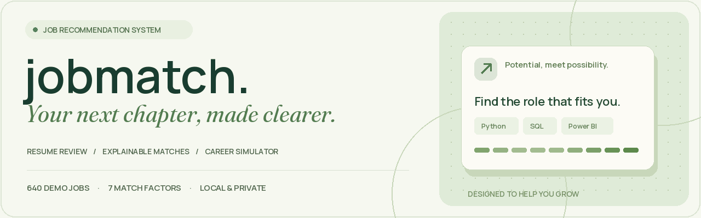
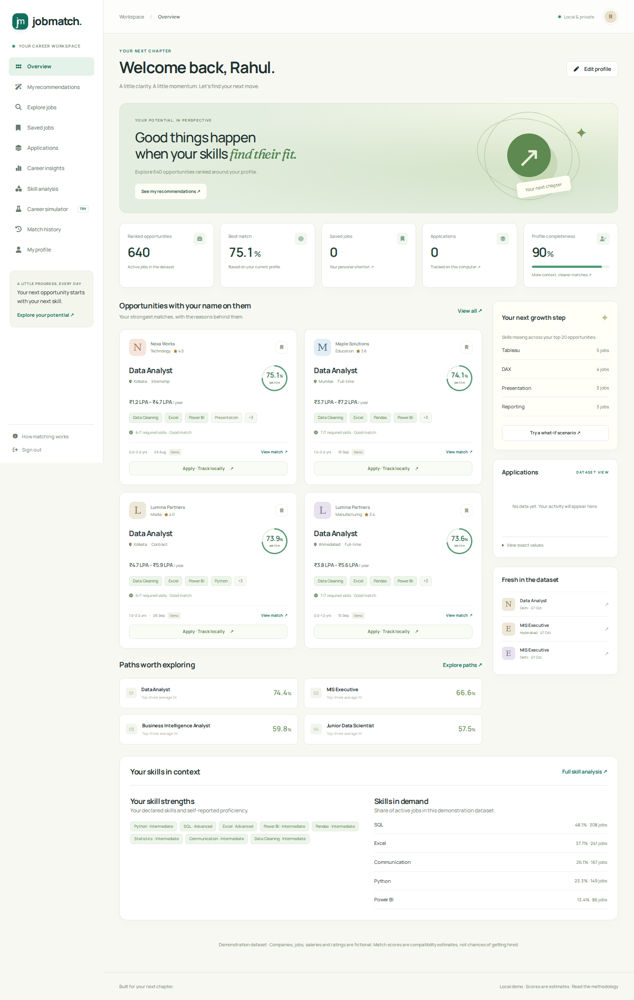
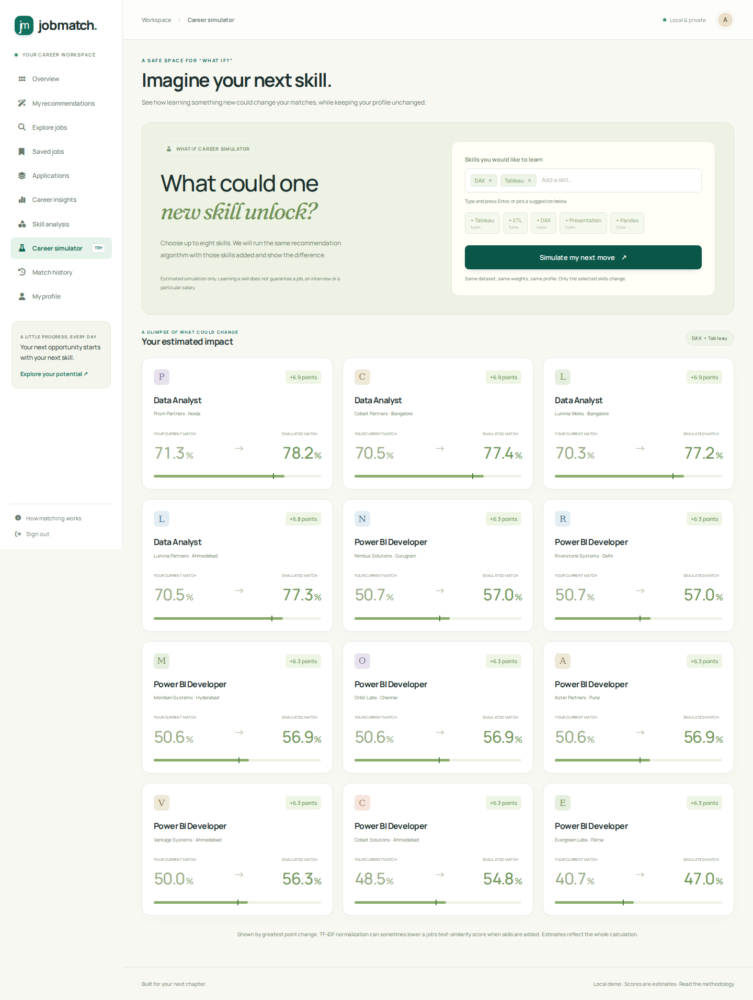
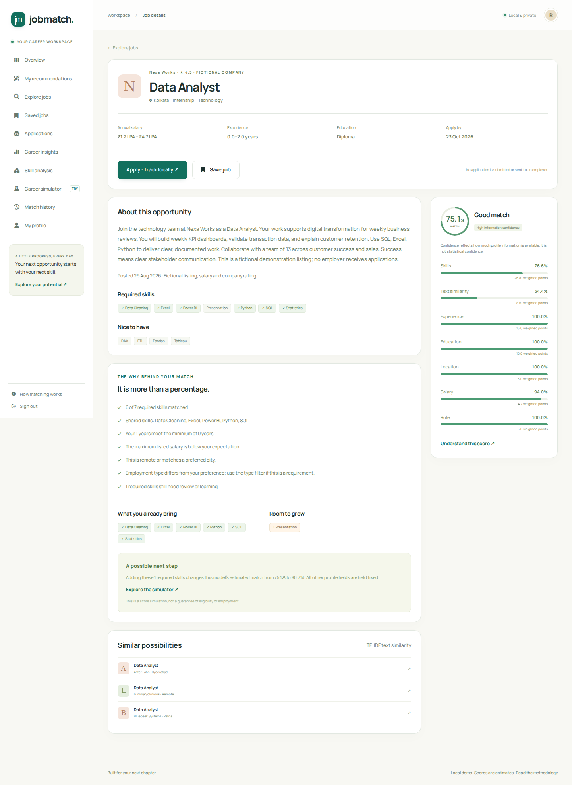
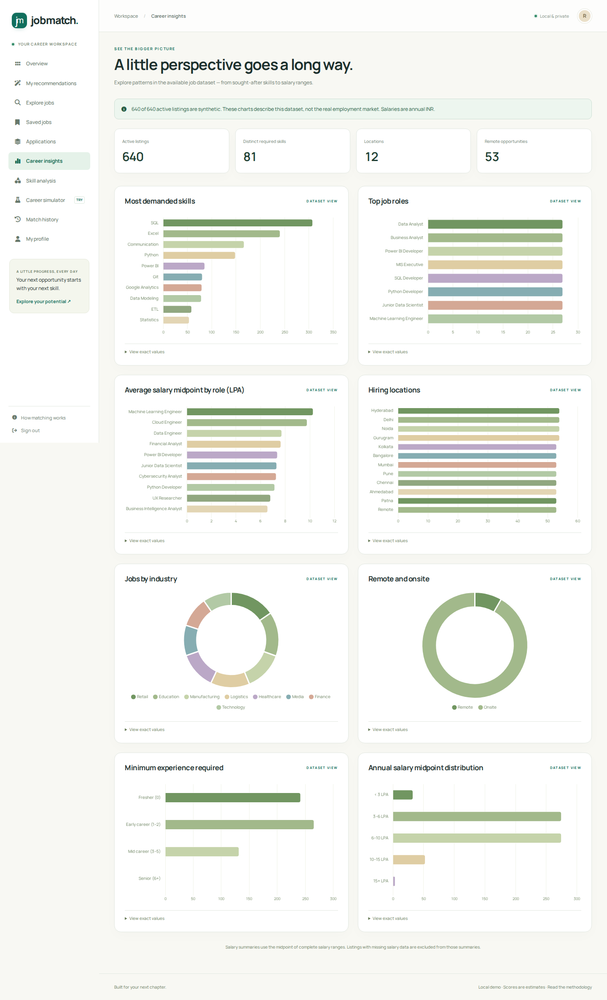
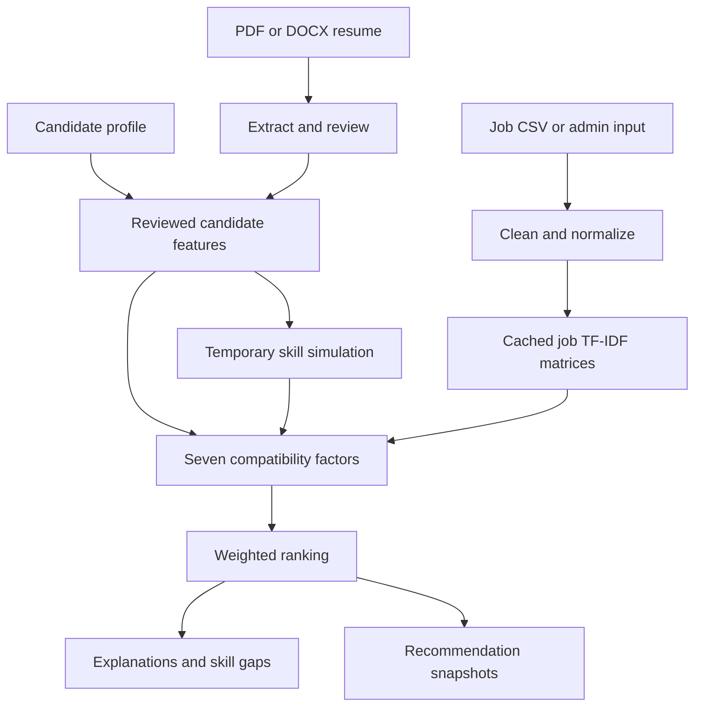

<div align="center">



# JobMatch — Job Recommendation System

**Your skills. Your direction. Your next chapter.**

[Quick start](#start-on-windows-in-vs-code) · [Hinglish guide](START_HERE_HINGLISH.md) · [Features](#what-is-implemented) · [Interface](#interface-and-motion) · [Validation](docs/VALIDATION.md)

`Python + Flask` · `SQLite` · `scikit-learn` · `640 demo jobs` · `Offline assets`

</div>

A complete local web application for explainable job recommendations, resume review, skill-gap analysis and career planning. Run it from VS Code and open **http://127.0.0.1:5000** in Google Chrome.

Built with Python, Flask, SQLite/SQLAlchemy, scikit-learn, Jinja2, Bootstrap 5 and vanilla JavaScript. All frontend assets are bundled locally. No API key, cloud service, Docker or paid subscription is needed.

> **This is a portfolio and learning platform.** The included 640 listings, companies, salaries and ratings are fictional. “Apply · Track locally” adds a personal tracker record; it does not contact an employer. Scores are model compatibility estimates, not hiring probabilities. “AI” here means dictionary NLP and unsupervised TF-IDF ranking, not an LLM.



## Start on Windows in VS Code

Install **64-bit Python 3.11 or 3.12**. Extract the archive, then open the inner `job-recommendation-system` folder in VS Code. The terminal must be in the folder containing `app.py`.

**From this GitHub repository:** clone/download `Adib0105/Md-Adib-Azam`, then open its `job-recommendation-system` subfolder. If the terminal is at the repository root, run `cd job-recommendation-system` first. Other portfolio projects have their own setup instructions.

Paste these commands into the VS Code PowerShell terminal:

```powershell
python -m venv venv
.\venv\Scripts\python.exe -m pip install -r requirements.txt
.\venv\Scripts\python.exe scripts\seed_database.py --demo
.\venv\Scripts\python.exe app.py
```

Then open **http://127.0.0.1:5000** in Chrome. Keep the terminal open while using the site. Press **Ctrl+C** to stop it. This is a local address on your own computer, not a public hosted link.

These commands call the virtual environment's Python directly, so PowerShell activation restrictions do not get in your way. If `python` is not found, create the environment with `py -3.12 -m venv venv` instead.

For later runs:

```powershell
.\venv\Scripts\python.exe app.py
```

Or activate the environment first, then use the requested short command:

```powershell
.\venv\Scripts\Activate.ps1
python app.py
```

In Command Prompt, activation is `venv\Scripts\activate.bat`. Do not change system execution policy just to activate the environment; the direct Python commands above are sufficient.

### Linux / macOS

```bash
python3 -m venv venv
source venv/bin/activate
python -m pip install -r requirements.txt
python scripts/seed_database.py --demo
python app.py
```

## Demo accounts

Created **only** when you explicitly run `seed_database.py --demo`. Normal first startup creates the job database and model, but no default accounts.

| Account | Sign-in page | Email | Password |
| --- | --- | --- | --- |
| Candidate | `/login` | `demo@jobmatch.com` | `Demo@123` |
| Admin | `/admin/login` | `admin@jobmatch.com` | `Admin@123` |

These are public demonstration credentials for local development only. Do not put a database containing them on a public server. `--demo` refuses to run with `APP_ENV=production`. To create your own administrator, run:

```powershell
.\venv\Scripts\python.exe scripts\create_admin.py
```

The administrator's password is entered privately in the terminal. Register your own candidate from the home page. No email delivery or email verification service is configured.

## What is implemented

- Candidate registration, separate admin sign-in, hashed passwords, expiring signed sessions, login throttling and CSRF protection.
- Editable profile with education, experience, technical/soft skill tags, self-reported proficiency, certifications, projects, career interests and preferences.
- PDF/DOCX resume extraction with file size/type/content validation and an owner-only, editable review step. No field is applied until confirmed.
- A deterministic seven-factor hybrid recommender with TF-IDF + cosine similarity, normalized skill coverage and gradual feature scores.
- Job-specific explanations, score contributions, matching and missing skills, completeness-based information confidence, and similar jobs.
- Search ranked by lexical similarity, query coverage, skill overlap and candidate fit. Structured title/skill/company/location/salary/experience/type/industry/match filters; pagination and sorting.
- Saved jobs, deduplicated local applications, and editable Saved/Applied/Screening/Interview/Offer/Rejected/Withdrawn statuses.
- Candidate dashboard, eight dataset insight charts with accessible data tables, personal skill comparison, top-20 skill gaps and career-path suggestions.
- What-if simulator that recalculates the complete model without modifying the real profile or recommendation history.
- Immutable top-50 recommendation snapshots after profile/resume changes, and same-job comparisons between the last two snapshots.
- Admin add/edit/remove jobs, candidate overview, query frequency, view counts, application statistics and historical recommendation statistics.
- JSON endpoints, friendly error pages, locally bundled charts/icons/styles, responsive desktop/tablet/mobile layouts and reduced-motion behavior.
- Automated backend tests, optional browser workflow tests, synthetic evaluation, Windows/Linux CI configuration, documented setup and screenshots.

## Interface and motion

A cream, sage and deep-green workspace pairs **Manrope** variable typography with **Fraunces** italic editorial accents. Both fonts, their licenses, icons and charts ship with the project and work without external requests after setup.

- A layered hero illustration with a card entrance, floating-note entrances and a short bar reveal.
- Staggered, once-only scroll reveals for features, recommendations and dashboard cards.
- Gentle card lifts, button-arrow feedback, animated match rings and chart entrances.
- Native reduced-motion support, keyboard focus indicators, immediately available content with JavaScript disabled, and responsive layouts.
- Decorative entrances finish automatically; the interface has no endless animation loops.

| Career workspace | Explore your next move |
| --- | --- |
|  |  |
|  |  |

See [`static/css/polish.css`](static/css/polish.css) for typography/visual styling, [`static/js/motion.js`](static/js/motion.js) for progressive motion, and [font sources and licenses](static/fonts/README.md).

The repository-level workflow [`.github/workflows/jobmatch.yml`](../.github/workflows/jobmatch.yml) checks this subfolder on Windows/Linux with Python 3.11/3.12. The project's own `.github/workflows/tests.yml` is retained for use if this folder is extracted into a standalone repository.

## Architecture

| Location | Responsibility |
| --- | --- |
| `app.py` | Flask application factory, first-run initialization, security headers, errors, loopback-only Waitress server |
| `config.py` | Environment settings, validated recommendation weights |
| `models/database.py` | Users, skills, jobs, saved jobs, applications, recommendation runs/results, resume drafts, search events |
| `models/skill_extractor.py` | Boundary-aware dictionary matching, aliases and skill normalization |
| `models/resume_parser.py` | Bounded PDF/DOCX parsing and editable field extraction |
| `models/recommendation_model.py` | Individually testable score and explanation functions |
| `services/recommendation_service.py` | Cached job features, ranking, similar jobs and snapshots |
| `services/data_service.py` | Dataset generator, preprocessing, idempotent CSV import |
| `services/analytics_service.py` | Demand, salary, career path, skill-gap and admin summaries |
| `routes/` | Authentication, candidate, jobs/API, recommendations and admin blueprints |
| `templates/` | Jinja screens and reusable UI components |
| `static/` | CSS, JavaScript, SVG mark and locally vendored assets |
| `data/jobs.csv` | 640 synthetic job records, across 24 roles and 12 locations |
| `data/processed_jobs.csv` | Cleaned output with normalized skills and model text |
| `scripts/` | Seed, generate data, build model, evaluate and create administrator |
| `tests/` | Unit, integration and optional browser workflow tests |
| `docs/` | Architecture notes, validation evidence, evaluation results and screenshots |
| `instance/` | Generated private database, random session key and joblib cache; never commit this directory |



SQLite foreign keys are enabled, email and owner/job pairs have uniqueness constraints, salaries/experience have range constraints, and relevant lookup columns are indexed. Job removal is a soft delete so saved applications and old snapshots retain their context.

## Recommendation algorithm

```python
overall = (
    skills * 0.35
    + semantic * 0.25
    + experience * 0.15
    + education * 0.10
    + location * 0.05
    + salary * 0.05
    + role * 0.05
)
```

Weights live in `config.py` and must be nonnegative, finite, contain the documented seven keys and sum to 1. The total is clamped to 0–100 and rounded to one decimal place.

| Factor | Scoring behavior |
| --- | --- |
| Skills | 85% required-skill coverage + 15% preferred-skill coverage when both lists exist. One list present: 100% weight to that list. Neither present: neutral 50. Aliases are normalized and repeated skills do not inflate coverage. |
| Text similarity | Fit word/bigram TF-IDF on the job corpus only; transform profile text and compute cosine similarity × 100. This measures lexical overlap, not deep semantic understanding. |
| Experience | Meets/exceeds minimum: 100. Below minimum: candidate years / minimum years × 100. Unknown candidate years: 50. Overqualified candidates are not automatically penalized. |
| Education | A six-level qualification hierarchy. Meeting/exceeding the level: 100; each level below subtracts 25. Unknown/unrecognized level: 50. No requirement: 100. Subject/accreditation equivalence is not verified. |
| Location | Preferred city or a remote job: 100. Same state: 80. Other city with relocation allowed: 85; otherwise 30. Missing location context: 50. Explicit location preference takes precedence over current state. |
| Salary | Expectation at/below the listed annual maximum: 100. Otherwise maximum / expectation × 100. Unknown values: 50. Salaries are INR per year. |
| Role | TF-IDF cosine similarity of preferred role and titles, expanded with a small documented vocabulary of related roles. |

Required skills come from the explicit field; if it is blank, the dictionary extracts skills from the job description. Candidate skill coverage uses the **reviewed skills list**; resume text influences text similarity. Self-reported proficiency is shown in skill analysis but is not treated as a verified ranking signal. Employment type is a filter and explanation note, rather than an eighth hidden score factor.

Information confidence is based on the presence of nine profile fields: High ≥8, Medium ≥4, otherwise Low. Profile completion separately covers ten equally weighted sections. Neither is a statistical estimate.

### Performance and reproducibility

Job-only matrices are cached in memory and in the private `instance/model.joblib` artifact. A hash of model version, scikit-learn version, job IDs and model text invalidates the cache when relevant data changes. Repeated requests do not retrain the corpus; up to eight recent feature sets are retained in memory. Profile vectors are transformed against the fixed corpus.

Search sorts by `0.45 × text similarity + 25 × token coverage + 15 × skill overlap + 0.15 × candidate match`. Explicit structured filters then constrain the results. Same inputs and dataset produce the same scores; there are no random match percentages.

The simulator adds only selected skills to a temporary profile. Its full recomputation can occasionally reduce text similarity because TF-IDF normalizes vector lengths. The UI shows the actual score difference rather than forcing an improvement.

## Dataset and preprocessing

The CSV is generated with a fixed random seed and a reference date. It includes 640 distinct descriptions, 24 role categories, all 12 requested locations, salary/experience variation and multiple sectors. Every record is explicitly marked synthetic.

```powershell
.\venv\Scripts\python.exe scripts\generate_dataset.py --count 640 --date 2026-10-07
.\venv\Scripts\python.exe scripts\seed_database.py
.\venv\Scripts\python.exe scripts\train_model.py
```

The importer trims whitespace/control characters, normalizes aliases, removes duplicate skill names/records, repairs reversed salary ranges, preserves genuinely unknown numeric values, and reports invalid rows. Admin forms instead reject reversed salary ranges so data-entry mistakes are visible.

`seed_database.py` is idempotent by source ID and **does not overwrite existing jobs or reset users**. Changing a CSV row with an existing ID does not update that database row; use the admin editor. To try a completely new dataset without losing existing data, point `JOBMATCH_INSTANCE` at a new empty directory before starting. The supplied example deadlines eventually expire; regenerate with a current reference date and use a new instance for a fresh demo. Do not delete a database that contains data you need.

## Resume behavior and privacy

- PDF/DOCX only, 5 MB request limit; PDFs with more than 30 pages and excessively expanded DOCX archives are rejected.
- Content signatures are checked in addition to extensions. Filenames are sanitized. The original upload is not served or kept on disk.
- Text is limited to 50,000 characters. Scanned images and encrypted PDFs receive actionable errors.
- Dictionary matching detects skills/technologies; headings and regexes suggest education, job titles, certifications, projects and explicit total experience. Date ranges are not automatically added up.
- A candidate reviews every extracted field before saving. Drafts are owner-scoped and inaccessible after one hour; stale drafts are deleted on the next resume upload.
- Confirmed resume text is private to the candidate profile in local SQLite. Removing it does not erase separately reviewed profile fields.
- Admin candidate listings omit passwords/hashes and resume content. JSON profile responses exclude resume text, account privileges and password fields.

## Internal API

| Endpoint | Authentication | Result |
| --- | --- | --- |
| `GET /api/jobs` | Optional | Paginated, filtered jobs; candidate scores when signed in |
| `GET /api/jobs/<id>` | Optional | One public job record |
| `GET /api/skills?q=sql` | Optional | Dictionary suggestions |
| `GET /api/profile` | Candidate session | Own safe profile fields |
| `GET /api/recommendations?page=1` | Candidate session | 20 explained results per page |
| `POST /api/recommend` | Session + CSRF | Save/reuse current snapshot and return top results |
| `GET /health` | Optional | Database-backed health check |

All state-changing form routes require CSRF tokens. API clients must retain the session cookie and supply `X-CSRFToken` with the token rendered in the page's `meta[name="csrf-token"]`. There is no cross-origin API access.

## Tests and evaluation

```powershell
.\venv\Scripts\python.exe -m pip install -r requirements-dev.txt
.\venv\Scripts\python.exe -m pytest
.\venv\Scripts\python.exe scripts\evaluate_model.py --output docs\evaluation.json
```

The test suite covers authentication/CSRF, isolation, ranking and cache behavior, score edge cases, valid/invalid uploads, confirmation before saving, simulator immutability, job filtering, CRUD, expired listings, idempotent seeding and restart persistence. See `docs/VALIDATION.md` for the actual tested environment and browser results. `.github/workflows/tests.yml` configures Windows/Linux CI; configured checks should not be confused with a completed GitHub Actions run.

`evaluate_model.py` reports Precision@K, Recall@K and NDCG@K for four hand-authored role-family scenarios against a deterministic synthetic corpus. This is a smoke test. Generated templates and relevance proxies make the task easier than real recruitment; these numbers **do not prove real-world recommendation quality**. No genuine relevance labels or hiring outcomes are supplied.

## Screenshots

| Screen | File |
| --- | --- |
| Landing page | `docs/screenshots/landing-desktop.png` |
| Candidate overview | `docs/screenshots/dashboard-desktop.png` |
| Job explanation | `docs/screenshots/job-match-desktop.png` |
| Dataset insights | `docs/screenshots/insights-desktop.png` |
| Career simulator | `docs/screenshots/simulator-desktop.png` |
| Mobile overview | `docs/screenshots/dashboard-mobile.png` |

## Configuration and limitations

- Local startup generates a random private session key under `instance/` unless `SECRET_KEY` is provided in the environment. No real secret is checked into source.
- `APP_ENV=production` requires an explicit secret and sets secure cookies. This project is designed for loopback use, not an internet deployment. Public hosting would also need HTTPS, isolated document processing, robust distributed rate limiting, email/account recovery, migrations, monitoring and a security review.
- Login throttling is in memory for a single process and resets on restart. SQLite and automatic schema creation are appropriate for this local project; there is no production migration system.
- PDF resource limits reduce risk but are not a replacement for sandboxed hostile-document processing. Upload trusted resumes on your own machine.
- No live vacancy scraping, employer submission, email delivery, password-reset service, embeddings, collaborative filtering or trained hiring-outcome model is implemented.
- Resume and education interpretation is approximate and favors English-language text. Add/correct fields manually where needed. Degree field, accreditation and work authorization must be verified independently.
- Career analytics describe the current dataset only. External validity, fairness, subgroup calibration and outcome quality require genuine consented evaluation data.
- Learning priorities and career paths are suggestions generated from listed skill requirements, not validated professional advice.
- Future improvements: labeled relevance evaluation, structured work-history parsing, real authorized vacancy imports, fairness evaluation, production migration support and stronger deployment isolation.

### Troubleshooting

| Issue | Action |
| --- | --- |
| `ModuleNotFoundError` | Use the virtual environment's Python and install `requirements.txt` into that same environment. |
| Python version too old | Use 64-bit Python 3.11 or 3.12; scikit-learn 1.8 requires Python 3.11+. |
| Port 5000 already in use | In PowerShell: `$env:PORT="5001"`, then start the app and open `http://127.0.0.1:5001`. |
| Resume has no readable text | Export a text-based PDF/DOCX or perform OCR before uploading. |
| CSRF/session expired | Refresh the form or sign in again. Keep cookies enabled for localhost. |
| No active jobs | Check deadlines and active flags in Admin; see the fresh-dataset instructions above. |
| PowerShell blocks activation | Use `.\venv\Scripts\python.exe` directly as shown in the quick start. |

## Third-party assets and technical references

Bootstrap 5.3.3, Chart.js 4.4.8 and Font Awesome Free 6.7.2 are included in `static/vendor`; their license notices are retained there. Font Awesome CSS paths are adjusted for the local directory layout. System fonts are used, with no external font request.

- [Flask file upload patterns](https://flask.palletsprojects.com/en/stable/patterns/fileuploads/)
- [Flask security considerations](https://flask.palletsprojects.com/en/stable/web-security/)
- [scikit-learn TF-IDF vectorizer](https://scikit-learn.org/stable/modules/generated/sklearn.feature_extraction.text.TfidfVectorizer.html)
- [scikit-learn pairwise metrics](https://scikit-learn.org/stable/modules/metrics.html)

Back up the private `instance/` directory yourself when you need to preserve local account/profile/application data. Do not commit it to GitHub or include it in a shared project archive.
