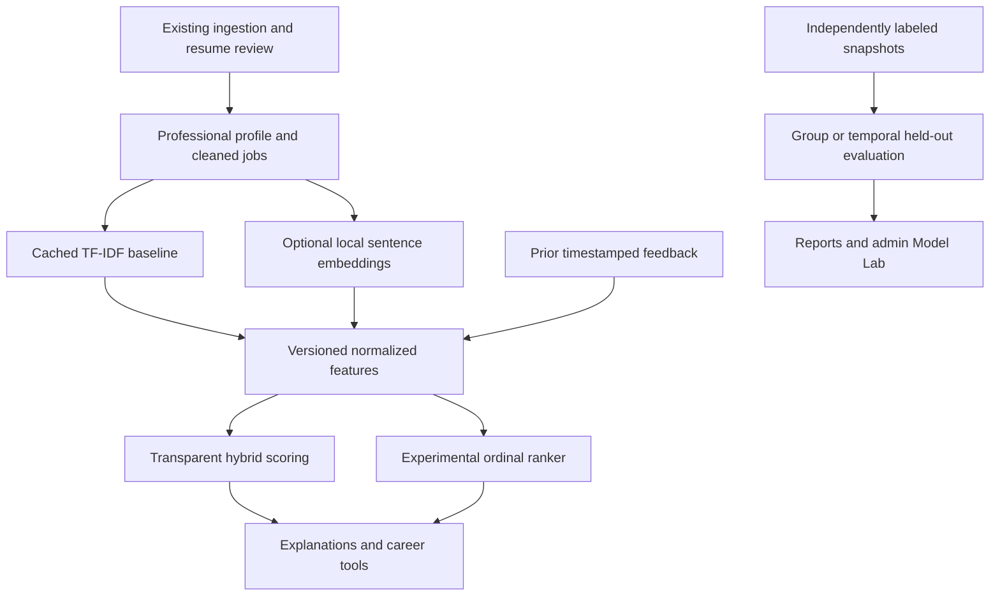

# AI/ML architecture

The application keeps its Flask/SQLAlchemy/Jinja structure. Existing services
remain responsible for business logic; `ml/` contains representation, feature,
training, persistence and evaluation components.

| Module | Responsibility |
|---|---|
| `ml/preprocessing/text.py` | Allowlisted professional text, Unicode normalization, explicit sensitive-line/contact removal |
| `ml/preprocessing/resume_intelligence.py` | Evidence inventory and configurable resume quality checklist |
| `ml/features/schema.py` | Stable 13-column normalized feature contract, without labels/identities |
| `ml/features/representation.py` | Persist and restore training vocabularies/IDF |
| `ml/features/behavior.py` | Prior interaction summary, decay, deduplication, cold-start thresholds |
| `ml/models/embeddings.py` | Optional CPU Sentence Transformer, local-only loading, batching, content/version cache |
| `ml/models/tfidf_cache.py` | Non-executable numeric TF-IDF cache |
| `ml/models/rankers.py` | Logistic/forest training and safe JSON inference with compatibility checks |
| `ml/pipelines/dataset.py` | Snapshot validation, existing cleaner reuse and held-out splits |
| `ml/pipelines/hybrid.py` | Explainable fusion and bounded ranker/behavior adjustment |
| `ml/evaluation/` | Query metrics and machine/human-readable comparisons |
| `ml/experiments/assignment.py` | Saved assignment before exposures |
| `services/career_intelligence.py` | Required-skill gaps, prerequisites and transition readiness |
| `routes/ml.py` | Authenticated career/resume pages and admin-only ML Lab |

**Rule-based:** skill matching, education/experience/location/salary fits, quality
checklist, learning dependencies, career skill readiness and hybrid weights.
**NLP:** tokenization/TF-IDF and dictionary/section extraction.
**Semantic similarity:** cosine between pretrained sentence vectors, when enabled.
The optional Transformer is pretrained externally; JobMatch does not fine-tune it.
**Trained here:** an experimental pointwise logistic ordinal classifier and random
forest ordinal regressor using labeled candidate/job pairs. Their output is
expected ordinal relevance utility, not a probability of getting hired.

The score service preserves the seven-factor baseline. `ML_STRATEGY` selects
`weighted`, `hybrid` (default), or `ltr`. With `ltr`, a compatible local ranker
uses its frozen training text features; missing/corrupt/version-mismatched models
fall back to hybrid. Embedding unavailability removes that component and
renormalizes the remaining weights. Synthetic rankers need an explicit demo opt-in.

Schema version 3 adds feedback, experiment, assignment and exposure tables only.
Existing user/tracker/provider/history rows and IDs are retained. Runtime caches,
models, review exports and documents stay under the private ignored instance folder.
