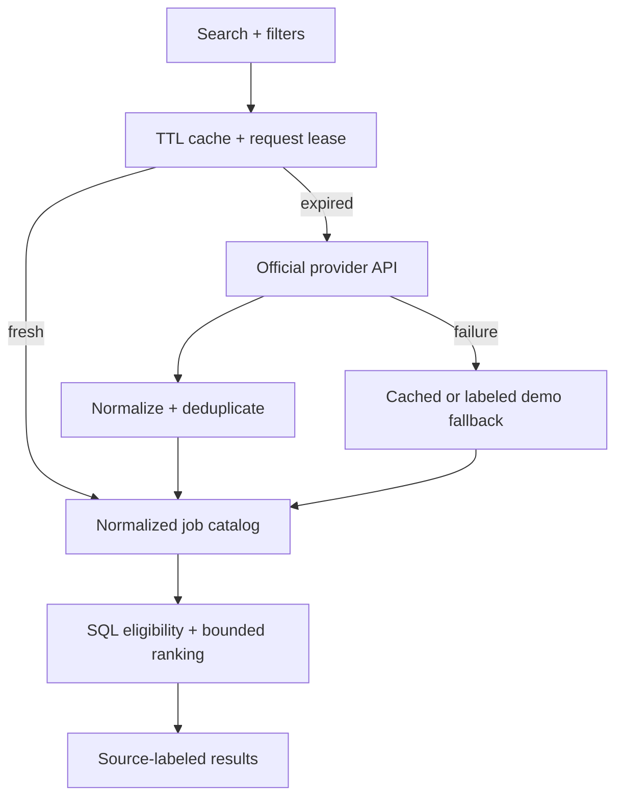

# Architecture and data contracts

JobMatch retains the Flask factory, Jinja UI, SQLite storage and existing seven-factor TF-IDF engine. The factory registers authentication, candidate, jobs, recommendation, original admin, control center, admin API, workspace and public-content blueprints. Waitress binds to loopback with four threads. External job calls run only on explicit live searches or operator sync actions.

## Discovery data path

`JobProviderBase` exposes `search_jobs`, `normalize_job`, `get_job` and `health_check`. `get_job` reads cached canonical data through the identity registry: neither provider receives an invented per-job detail endpoint. Adzuna maps its country-based REST search; USAJOBS maps official headers and search response descriptors. Transport injection keeps deterministic tests offline.

A cache row stores a hashed query key, non-secret normalized parameters, result IDs, timestamps, retry delay and lease. The database compare-and-set lease avoids simultaneous identical requests. Provider rate budgets are shared across app workers. Stale fallback is visibly described; normal eligibility still hides possibly expired entries. Public status returns flags only; administrators additionally see safe counters, latency and status messages.

## Persistent entities

| Entity | Purpose |
| --- | --- |
| User / CandidateSkill | Candidate profile, internal admin flag, scrypt password, activity state, session version, email verification, currency and remote preference |
| Job | Original features plus provider identity/URL, timestamps, provenance, pay period/currency, explicit remote state, known-experience flag and lifecycle flags |
| SavedJob / Application | Unique owner/job pairs; tracker status, notes, application/follow-up dates, contact and URL |
| RecommendationRun / Recommendation | Immutable top-50 snapshots, seven scores and original weights |
| ResumeDraft | Owner-bound extraction review with one-hour access expiry |
| SearchEvent / JobView | Source/location/count-aware searches and per-owner recent views |
| SchemaRevision | Additive schema version applied at maintenance/startup |
| UserSession | Hash of random session token, owner, version, remember flag, absolute/idle dates and revocation |
| PasswordResetToken / EmailVerificationToken | Hash-only, expiring single-use security tokens |
| RateLimitBucket | HMAC-scoped database counters shared across workers |
| ExternalJobIdentity | Unique provider/external ID aliases to canonical jobs |
| ExternalJobCache / JobProvider | Query cache/leases and provider operational state; no stored credentials |
| Notification | Owner-bound messages with unique deduplication key |
| JobAlert / JobAlertDelivery | Due schedule, bounded filters, delivery leases and unique job-alert records |
| AuditLog | Actor/subject identifiers, action and allowlisted safe metadata |
| SiteSetting | Validated weights/cache windows and escaped plain-text CMS fields |

Foreign keys and uniqueness constraints preserve relationships. Job deletion remains soft; snapshots and tracker entries retain their references. Migration v2 adds missing columns with compatible defaults, creates tables/indexes, normalizes old provenance/remote fields and disables the legacy public demo administrator. Existing SQLite files receive a private backup before migration. Manual production upgrade is required; run one migration process while app/workers are stopped.

## Ranking and honesty

SQL filters first select eligible published jobs, excluding deleted/archived/expired/stale listings. At most `MAX_RANKING_JOBS` (2,000 by default) are materialized for ranking. Live searches are upstream-paginated; unsupported filters narrow only that fetched page. Salary sorting/filtering keeps currency and annual period consistent.

The seven original components and 0–100 weighted score remain compatible. Unknown external experience/education and noncomparable salaries are neutral. Equal scores use employment, explicit remote preference, source freshness and information availability as tie-breakers, then stable job ID. The UI exposes this behavior; profile information confidence is not a hiring probability.

Job-only TF-IDF/role features use content fingerprints, an eight-entry memory cache and a private trusted joblib artifact. Writers use unique temporary names and atomic replacement. Uploaded model files are never loaded. Scores depend on the eligible corpus, so a changed source page or catalog can change lexical similarity. Snapshots preserve earlier results and weights. What-if skill simulation copies the profile in memory and does not mutate it.

Resume comparison uses only the confirmed resume text: 70% extracted skill coverage plus 30% TF-IDF similarity; absent required skills fall back to text similarity alone. Dictionary omissions and provider snippets limit recall. Suggested edits must be truthful; no ATS score is implied.

## Security and ownership

Every personal mutation resolves owner ID from the authenticated, revocable server session. Every administrator route enforces the internal role; public registration cannot set it. CSRF protects forms and mutating JSON requests. Session/password/email changes invalidate appropriate old sessions and pending tokens. Security tokens are atomically consumed, not deleted in a race-prone read-then-write sequence.

Provider URLs are fixed by adapters. Apply URLs permit public HTTP(S) only, reject credentials/control characters/private literal addresses, remove credential-like query parameters and open with `noopener noreferrer`. The backend never fetches those apply URLs. Provider text is stripped and Jinja-escaped. CMS never uses trusted HTML. CSV exports neutralize formula prefixes. Backup filenames are allowlisted; downloading requires current admin password.

Production validates HTTPS base URL, strong secret, Secure cookies and encrypted SMTP or disabled mail. Logging emits a safe JSON allowlist rather than raw exceptions/request URLs. Configure reverse-proxy access-log redaction separately. Rate limiting uses the observed client address; proxy trust is an operator decision.

## Worker and operational boundaries

Recovery emails use a small in-process thread executor. Development mail writes private `.eml` files; real SMTP uses TLS. Delivery configuration is reported separately from verified delivery. A durable production mail queue is future work.

The alert CLI processes due jobs with database leases, creates deduplicated in-app notifications and sends only pending new-job deliveries when the user has opted in and verified their email. It reads the local catalog; the sync CLI explicitly refreshes chosen provider queries. A scheduler is not installed implicitly. SMTP acceptance followed by worker crash can duplicate one email; this is not exactly-once messaging.

SQLite is the tested storage backend. The migration helpers, workers and API adapters require deployment validation before other databases or large-scale multi-host use. Private documents/backups need retention rules and an isolated parsing process for hostile public uploads. These are operational boundaries, not hidden claims of completed production hosting.
