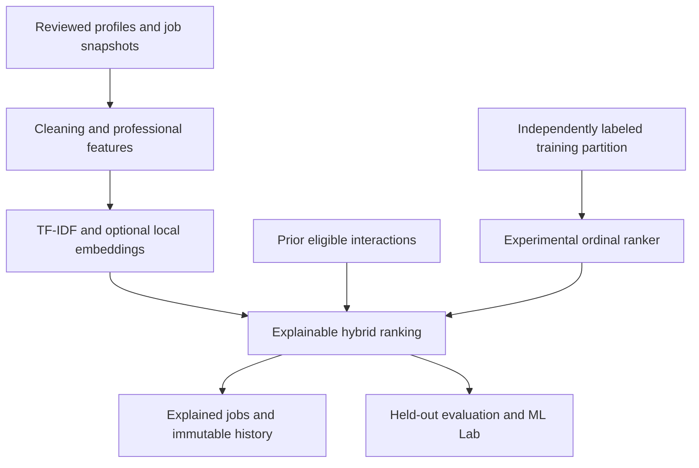

# Final AI/ML upgrade report

Date: 8 October 2026. Scope: `job-recommendation-system` and its GitHub Actions workflow.

The existing Flask application now has a modular, explainable hybrid recommender,
an experimental pointwise ranking pipeline, held-out synthetic evaluation, resume
and career intelligence, bounded personalization and recorded A/B experiments.
The default application works without Transformer weights or a trained ranker.
Real-world model quality is **not established** by this release.

## 1. Existing system

The source application already provided candidate/admin authentication, reviewed
PDF/DOCX resumes, profiles, skills, seven-factor recommendations, immutable history,
640 demo listings, official provider adapters, saved jobs, application tracking,
alerts, account recovery, charts and versioned SQLite migration. Its 167 tests were
run before changes and passed. The original baseline and user workflows remain.

## 2. Problems identified

- A component named semantic similarity was actually TF-IDF lexical similarity.
- Formula-derived smoke labels could not support independent model selection.
- There was no trained relevance ranker, held-out query evaluation, embedding
  lifecycle, feature contract or recorded model-assignment/exposure framework.
- Resume text could include irrelevant identity attributes in text features.
- Executable joblib cache persistence created an unnecessary artifact-loading risk.
- Resume parsing needed process isolation in addition to byte/page/ZIP limits.
- Tool aliases, behavioral cold start, reproducible explanations and extraction
  evidence needed explicit treatment.

See [AI_ML_AUDIT.md](AI_ML_AUDIT.md) for architecture, risks and priorities.

## 3. Changes implemented

| Requested phases | Delivered behavior |
|---|---|
| 1–2 Audit and pipeline | Audit; ingestion reuse; preprocessing, features, training, safe persistence, inference and evaluation modules |
| 3 NLP and embeddings | TF-IDF baseline; optional local pinned MiniLM inference; content/model caches, batches, version metadata and graceful fallback |
| 4 Hybrid | Twelve separately explained factors; normalized configuration; unavailable semantic weight removed and renormalized |
| 5 ML ranking | Logistic ordinal classification and Random Forest regression, exported to validated portable JSON; experimental 80/20 hybrid/ranker inference |
| 6–8 Dataset/evaluation | 240 explicit synthetic judgments; disjoint candidate split; P/R/NDCG at 5/10/20, MRR, MAP, per-query JSON, tables and admin charts |
| 9–10 Resume intelligence | Technical/soft skills, sections, explicit years, roles/organizations, tools/languages/domains, heuristic confidence and configurable Resume Strength |
| 11–12 Gaps and learning | Job/target-role matched, partial and missing skills; gap percentage/priority; prerequisite-ordered learning ending in a portfolio project |
| 13–14 Personalization | Views, saves, applies, explicit reject/ignore, interview/offer; 90-day decay, 365-day window and bounded adjustment after history thresholds |
| 15–16 Explainability | Deterministic factors/contributions, strongest/weakest factors, global importance and local feature-zero ablations for the top 20 returned ML results |
| 17 Career intelligence | Student → Junior Data Analyst → Data Analyst → Senior Data Analyst → Analytics Engineer → Data Scientist, with skill readiness/difficulty |
| 18–19 Lab and experiments | Admin-only six-chart ML Lab; disabled-by-default operator experiments; assignment saved before exposure, displayed positions and attributed actions |
| 20–21 Fairness/versioning | Professional feature allowlist, minimized identity text, bias limitations; model/dataset/feature/dependency/parameter/metric metadata |
| 22 Performance | Bounded catalog, TF-IDF LRU/disk cache, lazy model load, batched cached embeddings, single registry load and capped local ablations |
| 23–24 Tests/security | New component/workflow checks, additive schema v3, worker isolation, non-executable artifacts, existing auth/CSRF/provider controls preserved |
| 25–26 Docs/frontend | All requested reports and viva notes; incremental Resume Intelligence, Career Path, breakdown and ML Lab pages using existing UI assets |
| 27–28 Dependencies/leakage | Optional large dependencies; pinned API compatibility review; training-only preprocessing, no label columns, UTC temporal/cutoff checks |
| 29–30 Quality gate/report | Local tests, lint, formatting, compilation, startup/migration/training/inference and actual Chromium smoke; this report and defense notes |

Optional XGBoost/LightGBM and MLflow are not installed: the two requested scikit-learn
rankers and local versioned reports demonstrate the pipeline with existing base
dependencies. Genuine Transformer backend code is implemented, but real checkpoint
inference was not exercised in this environment; no embedding metrics are invented.

## 4. ML architecture

The Flask service reuses existing catalog and profile services. `ml/` separates
text preprocessing, professional features, behavioral features, optional embedding
and portable ranker services, hybrid scoring, dataset ingestion and evaluation.
Routes call these services; they do not train or accept uploaded models.

Dictionary extraction, quality checklists, skill gaps, career paths and hybrid
weights are **rules**, not learned models. TF-IDF fits vocabularies/IDF. Logistic
and forest rankers learn coefficients/trees from ordinal labels. Sentence Transformer
inference uses a separately prepared pretrained neural checkpoint; no fine-tuning
or placement prediction occurs. See [AI_ML_ARCHITECTURE.md](AI_ML_ARCHITECTURE.md).

## 5. Data pipeline

The committed fixture contains 12 fictional candidate snapshots, 20 duty-based
job snapshots and a manually authored 240-cell label table independent of the
score formula. This is **synthetic author-created data**, not expert or behavioral
validation. Dataset SHA-256:

`4819b53cebb0200ebf54415d59c92b5935aecd9d6d1c56bb188ed93f1b6acd8e`.

The loader rejects duplicates, incompatible versions, sensitive profile keys,
non-finite values, label/prediction feature leakage, future postings and inconsistent
snapshots. All evaluated candidate/job pairs must be judged; unjudged jobs are never
negative labels. Real snapshots preserve currency/pay period and source/experience
uncertainty. Fixture jobs cannot be labeled as real manual/behavioral evaluation.
A private blind review exporter writes null labels, pseudonymous candidate IDs and
no predictions; reviewers must supply actual judgments before evaluation.

Synthetic/manual data uses a 75/25 candidate-group split (seed 2026). Nine candidates
and 180 pairs train; three unseen candidates and 60 pairs evaluate against the known
20-job catalog. Vocabularies/IDF fit only training snapshots. Behavioral data uses
UTC temporal splits and requires training target observation before the test window.
Offline snapshots intentionally disable behavior features until a separate event
reconstruction pipeline is audited. See [DATA_PIPELINE.md](DATA_PIPELINE.md).

## 6. Recommendation methodology

Default hybrid weights combine skills .30, TF-IDF .19, optional semantic .14,
experience .12, education .08, location .05, salary .04, role .035 and employment,
remote and freshness .015 each. Without embeddings, available weights are
renormalized. Current config validation checks finite ranges and sums.

At least five distinct interacted jobs and three meaningful job interactions are
required for behavior. Its effective weight is at most .10; remaining factors keep
their proportions. Employer rejection is a neutral outcome, not evidence that a
candidate dislikes a job. Each adjustment records its reason and cutoff. New users
keep profile-based recommendations. These are ranking scores, not probabilities.

Optional live ML inference blends 80% hybrid and 20% expected ordinal utility and
checks the frozen text/embedding representation. The evaluator compares the two
rankers' standalone utility against baseline/hybrid; it does not present blended
inference as a separately measured model. Synthetic trained models are inactive
unless explicitly enabled for a local demonstration.

See [RECOMMENDER_METHODOLOGY.md](RECOMMENDER_METHODOLOGY.md).

## 7. Models evaluated

TF-IDF, original seven-factor weighted, hybrid, logistic ranker and Random Forest
ranker were actually evaluated. The embedding-only entry is unavailable because
real local Transformer weights were not loaded. The hybrid result is consequently
its lexical/rule fallback. Models, dependency versions, parameters and training
sample counts are recorded in [model_evaluation.json](model_evaluation.json).

## 8. Metrics

Binary relevance is label ≥2. NDCG uses graded 0–3 gain. Queries are macro-averaged;
MAP and MRR use each full judged ranking. Full K=5/10/20 tables and individual-query
results are in [MODEL_EVALUATION.md](MODEL_EVALUATION.md) and its JSON.

| Model | Precision@5 | NDCG@10 | MRR | MAP |
|---|---:|---:|---:|---:|
| TF-IDF | .5333 | .9402 | 1.0000 | 1.0000 |
| Weighted baseline | .5333 | .9451 | 1.0000 | 1.0000 |
| Embeddings | Unavailable | Unavailable | Unavailable | Unavailable |
| Hybrid fallback | .5333 | .9479 | 1.0000 | 1.0000 |
| Logistic ranker | .5333 | .9623 | 1.0000 | 1.0000 |
| Random Forest ranker | .4667 | .9462 | 1.0000 | .9444 |

Perfect MRR/MAP on several methods reflects this narrow, easy synthetic test pool;
it is not evidence of perfect recommendations. There are only three held-out queries.

## 9. Best model

Logistic ranking has the highest NDCG@10 **on this fixture only**. Hybrid improves
NDCG@5 from .9432 (weighted) to .9631, while Precision@5 remains identical. No
real-world production winner or statistically significant improvement is claimed.
`best_model` is null; only `best_model_on_fixture` is populated for synthetic data.

## 10. Limitations

- No independently reviewed real-label dataset or real behavioral evaluation exists
  in this release. Query pools are small and the job catalog is known to training.
- Optional MiniLM checkpoint quality, memory and target-device CPU latency require
  actual model preparation and measurement; a deterministic test encoder verifies
  infrastructure only and is never used for quality metrics.
- Pointwise ordinal ranking is an educational LTR baseline, not pairwise/listwise
  optimization. Repeated test-set model choice can overfit this small fixture.
- Extraction confidence, resume quality, skills readiness and career difficulty are
  transparent heuristics, not verified credentials, ATS scores or employment outcomes.
- English dictionaries/embeddings and short snippets can miss skills and context.
  Protected attributes are excluded directly, but proxies and biased job language
  remain possible. No fairness certification or sensitive-group parity result exists.
- Experiments count recorded, attributed actions; they do not yet estimate unbiased
  conversion rates, significance or causal effects. Tracker applies are local records.
- Large-scale throughput, multiworker load and hardened public-deployment behavior
  were not benchmarked. External-provider/SMTP tests use fixtures without live keys.

## 11. Security

Existing authentication, scrypt passwords, revocable sessions, recovery-token
handling, owner scope, CSRF, admin authorization, trusted origins, HTTPS production
checks, bundled frontend assets and provider endpoint/timeout/response controls
remain. The new feedback action is owner-scoped, CSRF-protected and rate-limited;
ML Lab is administrator-only.

Resume uploads run in a private subprocess: bounded bytes/pages/expanded ZIP/text,
15-second parent timeout and Linux CPU/address-space limits. Secrets are removed
from the child environment. A container provides stronger hostile-document isolation
than this local worker; Windows uses the parent timeout and existing document bounds.

TF-IDF persistence uses numeric NPZ/JSON with `allow_pickle=False`. Rankers contain
validated finite coefficients/trees and frozen vocabularies, bounded file sizes,
digests and strict feature/dependency versions. There is no arbitrary model upload
or in-request training/download endpoint. Hashes detect accidental corruption;
operator-owned private storage, not hashes alone, supplies trust.

Schema v3 adds four tables/indexes. Both legacy v1 and simulated complete v2 database
upgrades preserve records and history, make integrity-checked private SQLite backups,
and remain idempotent. Existing production migration approval gates are preserved.

## 12. Testing and local quality gate

Local runtime: Linux, Python 3.12.14; base pinned dependencies. The CI matrix remains
Linux/Windows and Python 3.11/3.12; remote results are separate from local evidence.

| Check | Local result |
|---|---|
| Existing baseline | 167 tests passed before implementation |
| Final full suite | 226 tests passed, including 59 added ML/workflow/migration cases |
| Ruff / Black | Passed; 89 Python files checked for formatting |
| Compilation/imports | Application, config, models, routes, services, ML and scripts compile; startup imports succeed |
| Startup and TF-IDF CLI | Fresh app HTTP 200; 640 jobs / 1,952 TF-IDF features indexed with a non-executable cache |
| Migration | v1/v2 preservation, backups, idempotence and non-destructive manual gate tested |
| Ranker training/prediction | Logistic and forest CLI training on 180 fixture pairs; safe round-trip/sklearn parity tests; logistic live inference over 640 jobs |
| Endpoints/resume | Auth/CSRF/corrupt fallback plus DOCX → isolated parsing → review → profile → recommendations; personalization/save/apply/feedback integration passed |
| Chromium UI | Browser 134.0.6998.35, 31 viewport checks, six rendered ML charts, profile/resume/tracker/admin workflows; no JS errors/failed resources/external requests |

Browser evidence is [ml_browser_smoke.json](ml_browser_smoke.json); the reproducible
test is `tests/browser_smoke.cjs` against a disposable local instance with independently
created credentials. The three new screens were visually inspected after rendering.

A single fresh SQLite timing exercise ranked 640 synthetic jobs with embeddings
disabled: startup plus seed .7807 seconds, first profile rank .4002 seconds, five
warm ranks .2321–.3537 seconds. See [local_performance.json](local_performance.json)
for the exact scenario. This is a local observation, not a throughput or SLA claim.

## 13. Future improvements

Collect larger independent graded judgments and audited temporal interaction
snapshots, define label observation windows and inter-reviewer agreement, and add
an untouched validation/test protocol before selecting a model. Prepare the real
pinned Transformer checkpoint and measure its quality, truncation, latency and
memory on intended hardware. Evaluate unseen employers/job families, multilingual
profiles, representation drift and fairness proxies. Only then consider pairwise
rankers, calibrated relevance estimates, ANN retrieval, bias-aware exposure analysis
and properly powered experiments. None of these future results are implied today.

For technically correct viva answers, see [PROJECT_DEFENSE_NOTES.md](../PROJECT_DEFENSE_NOTES.md).
